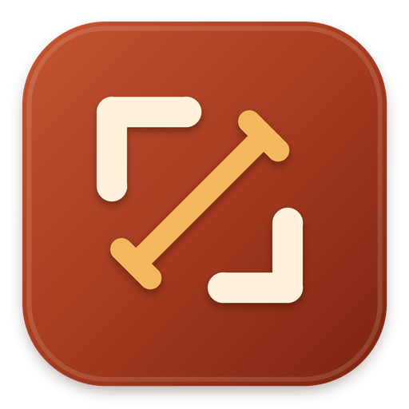
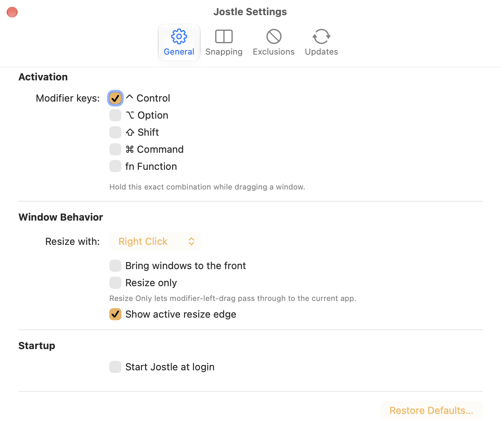

<p align="center">
  
</p>

<h1 align="center">Jostle</h1>

<p align="center"><strong>Move, resize, and tile macOS windows—and keep your Mac awake—from one menu bar app.</strong></p>

<p align="center">
  <a href="https://github.com/paulfri/jostle/releases/latest"></a>
  <a href="https://github.com/paulfri/jostle/actions/workflows/ci.yml"></a>
  
  <a href="LICENSE.txt"></a>
</p>

Jostle is a native menu bar utility for controlling windows without hunting for title bars or tiny resize handles, customizing mice and trackpads, and preventing idle sleep when you need your Mac to stay awake. Hold a modifier or an extra mouse button and drag from anywhere inside a window, reverse scrolling per device type, let focus follow the pointer for selected apps and devices, or start a timed Keep Awake session from the same menu bar icon. Jostle stays out of the Dock and offers snapping, per-app and per-device rules, configurable spacing, automation, and optional launch-at-login and update checks.

## Controls

The default modifier is **Control** (`⌃`). Jostle only responds when the exact configured modifier combination is held.

| Action | Default gesture |
| --- | --- |
| Move a window | `Control` + left-drag |
| Resize a window | `Control` + right-drag near the edge or corner you want to move |
| Maximize or restore | `Control` + double-left-click |
| Tile by clicked region | `Control` + double-click with the resize button |
| Snap while moving | Drag to a screen edge or corner, then release |
| Cancel an active move or resize | `Escape` |

The resize button can be changed from right click to middle click. Modifier keys, double-click actions, snapping, resize feedback, tile gaps, and screen margins are all configurable from Settings.

The **Apps** settings let you choose the defaults for window controls and Focus Follows Pointer, then override either behavior for individual applications. This supports include-only setups such as enabling pointer focus for every `eqgame.exe` window while leaving all other applications unchanged. Focus can be immediate or delayed until the pointer rests.

## Mouse and trackpad customization

Enable **Input Customizations** from Jostle's menu or its **Input** settings tab. The opt-in MVP provides:

- Independent reverse-scrolling defaults for mice and trackpads
- Button 4 and Button 5 mappings for Back, Forward, move, resize, maximize, left/right tile, next display, and Keep Awake
- A universal Back/Forward preset that maps otherwise-unassigned side buttons to `⌘[` and `⌘]`
- Per-device scrolling and Focus Follows Pointer overrides for connected or previously configured pointing devices

Button-held move and resize use the same safe window engine as Jostle's modifier gestures. A gesture remains bound to its initiating button through drag and release, and `Escape` cancels it. Input processing is fail-open: unsupported devices and unhandled events keep native macOS behavior.

Input customization requires Accessibility permission. It can be disabled independently of window gestures and Keep Awake. After repeated unclean launches, Jostle starts in Safe Mode with input interception disabled; `--safe-mode` provides the same recovery path explicitly.

## Keep Awake

Choose **Keep Awake** in Jostle's menu to prevent idle sleep indefinitely or for 10 or 30 minutes, or 1, 2, 4, 8, or 12 hours. By default, left-clicking the menu bar icon opens the menu and right-clicking toggles Keep Awake using your preferred duration. You can swap those actions or assign a global keyboard shortcut in Settings.

Jostle's four-corner frame stays fixed in the menu bar: its center is empty at rest, shows a cup during Keep Awake, and shows a moon when a session is paused while the screen is locked. This state remains visible even when window gestures are unavailable.

The Keep Awake settings also let you:

- Allow the display to sleep while keeping the Mac itself awake
- Pause the assertion and countdown while the screen is locked
- Turn Keep Awake off when the Mac switches from external power to battery
- Start a session when Jostle launches
- Choose the branded cup, a green or blue cup, or a fully colored active icon, and optionally dim the icon while inactive
- Show a notification when a timed session finishes

Timed sessions always use monotonic timing so they remain accurate across sleep and system-clock changes. Keep Awake is independent of Jostle's Accessibility permission, so it remains available even if window controls are disabled.

### Automation

Jostle includes native Shortcuts actions named **Set Keep Awake State** and **Get Keep Awake State**. Set can turn Keep Awake on or off, toggle it, use the configured default duration, run indefinitely, or accept a custom duration in seconds.

You can also open `jostle:` URLs:

```sh
open 'jostle:activate'
open 'jostle:activate?hours=1&minutes=30'
open 'jostle:deactivate'
open 'jostle:toggle?minutes=10'
```

Duration parameters may use `hours` and `minutes` together. Values must be greater than zero and within the supported range.

## Screenshots

<p align="center">
  
</p>
<p align="center"><sub>Configure Jostle from a native, frame-branded Settings window.</sub></p>

## Features

- Move and resize from any point inside a window
- Snap to screen halves, quarters, or the full usable display, with a live preview
- Restore a snapped or maximized window to its previous frame
- Choose any combination of Control, Option, Shift, Command, and Function
- Use right click or middle click for resizing
- Show the active resize edge while dragging
- Add gaps between tiled windows and margins around the screen
- Reverse scrolling independently for mice, trackpads, and individual pointing devices
- Map extra mouse buttons to window, navigation, display, and Keep Awake actions
- Move and resize windows by holding an extra mouse button
- Configure window controls and Focus Follows Pointer independently per app and pointing device
- Match apps without bundle identifiers, including Wine-hosted executables such as `eqgame.exe`
- Choose immediate pointer focus or a 100, 250, or 500 ms dwell delay
- Temporarily disable all window features from the menu bar icon
- Keep the Mac awake indefinitely or for a selected duration
- Control Keep Awake by menu-bar click, global shortcut, `jostle:` URL, or Shortcuts action
- Pause while locked or deactivate automatically when switching to battery power
- Start automatically at login
- Install signed updates with Sparkle; automatic checks are opt-in

## Install

Jostle requires **macOS 13 Ventura or later**.

1. Download the DMG from the [latest release](https://github.com/paulfri/jostle/releases/latest).
2. Open it and drag **Jostle** into **Applications**.
3. Launch Jostle and grant the requested **Accessibility** permission.
4. Use the Jostle icon in the menu bar to open Settings or enable launch at login.

Reopen Jostle after granting Accessibility access if macOS does not activate it immediately. Jostle is distributed outside the Mac App Store and release builds are Developer ID signed and notarized by Apple.

## Accessibility permission

Jostle uses the macOS Accessibility API to find the window under the pointer, update its position and size, and raise it when Focus Follows Pointer applies. It does not require Screen Recording permission. Apps that do not expose movable or resizable windows through Accessibility may not respond to every action.

If Jostle loses permission or its event monitor stops, the menu bar icon dims and its menu provides an action to fix or retry the unavailable service.

## Build from source

You will need macOS and Xcode.

```sh
git clone https://github.com/paulfri/jostle.git
cd jostle
open Jostle.xcodeproj
```

Select the **Jostle Development** scheme and run it. Development builds use a separate bundle identifier, settings store, app icon, and Accessibility entry so they can coexist with an installed release.

Run the complete test suite from the command line:

```sh
xcodebuild \
  -project Jostle.xcodeproj \
  -scheme 'Jostle Development' \
  -destination 'platform=macOS' \
  -derivedDataPath build-tests \
  CODE_SIGNING_ALLOWED=NO \
  test

swift test --package-path JostleCore
```

The repository is split into a small AppKit/SwiftUI menu bar app in `Jostle/` and a deterministic Swift package in `JostleCore/` for event policy, input profiles, gesture state, geometry, snapping, Keep Awake commands, URL parsing, and settings behavior.

See [CONTRIBUTING.md](CONTRIBUTING.md) for contribution guidance and [docs/releasing.md](docs/releasing.md) for the signed release process.

## Heritage and license

Jostle continues the idea behind Daniel Marcotte's Easy Move+Resize with a native Swift implementation maintained by Paul Friedman.

Released under the [MIT License](LICENSE.txt).
