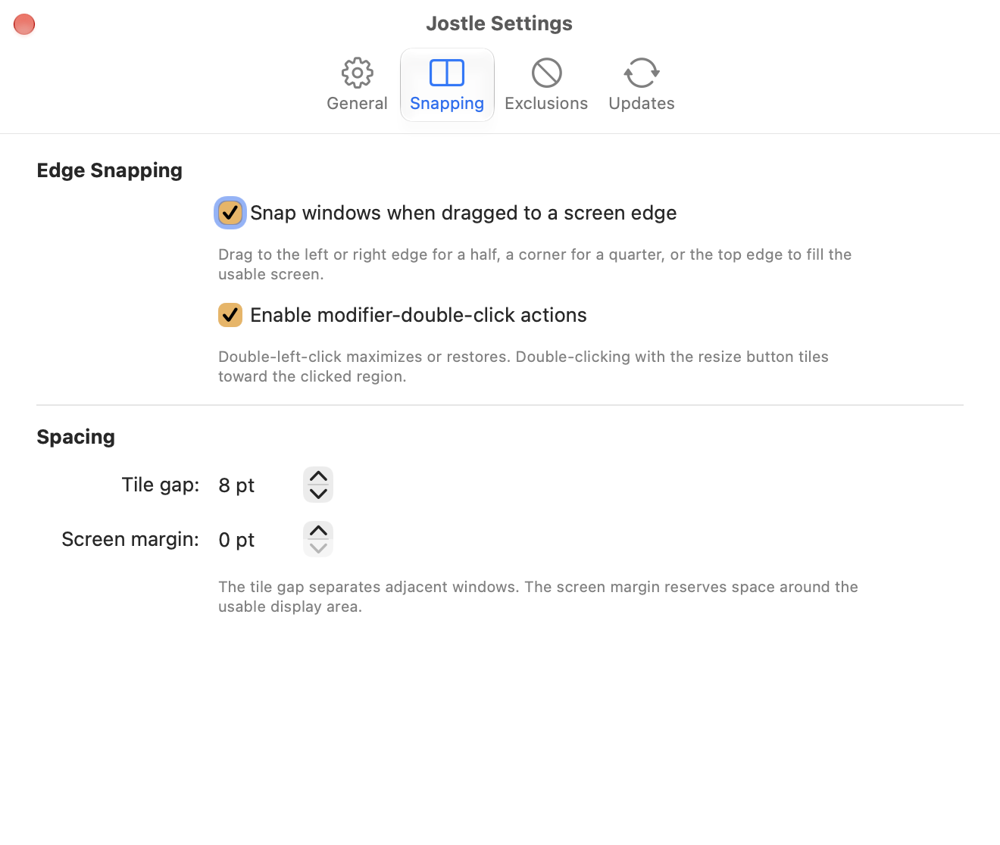

<p align="center">
  
</p>

<h1 align="center">Jostle</h1>

<p align="center"><strong>Move, resize, and tile macOS windows from anywhere inside them.</strong></p>

<p align="center">
  <a href="https://github.com/paulfri/jostle/releases/latest"></a>
  <a href="https://github.com/paulfri/jostle/actions/workflows/ci.yml"></a>
  
  <a href="LICENSE.txt"></a>
</p>

Jostle is a native menu bar utility for controlling windows without hunting for title bars or tiny resize handles. Hold a modifier, point anywhere inside a window, and drag. It stays out of the Dock and offers snapping, per-app exclusions, configurable spacing, and optional launch-at-login and update checks.

## Controls

The default modifier is **Control** (`⌃`). Jostle only responds when the exact configured modifier combination is held.

| Action | Default gesture |
| --- | --- |
| Move a window | `Control` + left-drag |
| Resize a window | `Control` + right-drag near the edge or corner you want to move |
| Maximize or restore | `Control` + double-left-click |
| Tile by clicked region | `Control` + double-click with the resize button |
| Snap while moving | Drag to a screen edge or corner, then release |
| Cancel an active move or resize | `Escape` |

The resize button can be changed from right click to middle click. Modifier keys, double-click actions, snapping, resize feedback, tile gaps, and screen margins are all configurable from Settings.

## Screenshots

<table>
  <tr>
    <td width="50%"></td>
    <td width="50%"></td>
  </tr>
  <tr>
    <td align="center"><sub>Choose how Jostle activates and behaves.</sub></td>
    <td align="center"><sub>Configure snapping and spacing.</sub></td>
  </tr>
</table>

## Features

- Move and resize from any point inside a window
- Snap to screen halves, quarters, or the full usable display, with a live preview
- Restore a snapped or maximized window to its previous frame
- Choose any combination of Control, Option, Shift, Command, and Function
- Use right click or middle click for resizing
- Show the active resize edge while dragging
- Add gaps between tiled windows and margins around the screen
- Ignore selected applications, including apps without bundle identifiers
- Temporarily disable Jostle from its menu bar icon
- Start automatically at login
- Install signed updates with Sparkle; automatic checks are opt-in

## Install

Jostle requires **macOS 12 Monterey or later**.

1. Download the DMG from the [latest release](https://github.com/paulfri/jostle/releases/latest).
2. Open it and drag **Jostle** into **Applications**.
3. Launch Jostle and grant the requested **Accessibility** permission.
4. Use the Jostle icon in the menu bar to open Settings or enable launch at login.

Reopen Jostle after granting Accessibility access if macOS does not activate it immediately. Jostle is distributed outside the Mac App Store and release builds are Developer ID signed and notarized by Apple.

## Accessibility permission

Jostle uses the macOS Accessibility API to find the window under the pointer and update its position and size. It does not require Screen Recording permission. Apps that do not expose movable or resizable windows through Accessibility may not respond to every action.

If Jostle loses permission or its event monitor stops, the menu bar icon dims and its menu provides an action to fix or retry the unavailable service.

## Build from source

You will need macOS and Xcode.

```sh
git clone https://github.com/paulfri/jostle.git
cd jostle
open Jostle.xcodeproj
```

Select the **Jostle Development** scheme and run it. Development builds use a separate bundle identifier, settings store, app icon, and Accessibility entry so they can coexist with an installed release.

Run the complete test suite from the command line:

```sh
xcodebuild \
  -project Jostle.xcodeproj \
  -scheme 'Jostle Development' \
  -destination 'platform=macOS' \
  -derivedDataPath build-tests \
  CODE_SIGNING_ALLOWED=NO \
  test

swift test --package-path JostleCore
```

The repository is split into a small AppKit/SwiftUI menu bar app in `Jostle/` and a deterministic Swift package in `JostleCore/` for event policy, gesture state, geometry, snapping, and settings behavior.

See [CONTRIBUTING.md](CONTRIBUTING.md) for contribution guidance and [docs/releasing.md](docs/releasing.md) for the signed release process.

## Heritage and license

Jostle continues the idea behind Daniel Marcotte's Easy Move+Resize with a native Swift implementation maintained by Paul Friedman.

Released under the [MIT License](LICENSE.txt).
